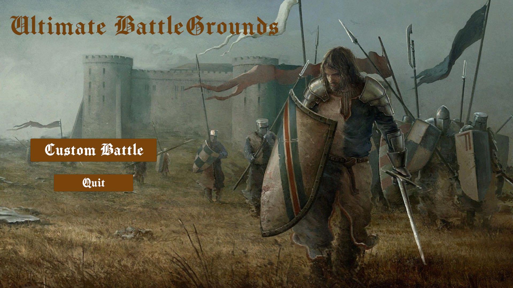

# Ultimate-Battle-Grounds
A battle simulator built in unity, which is kinda a combination between Age Of Empires and Ultimate Epic Battle Simulator (UEBS)

## Controls

### Gameplay:
* F to start the battle (make troops in attack mode)
* [ and ] to speed up and slow down the battle speed
* M to exit battle and return to main menu

### Camera:
* WASD + Shift to boost
* Move mouse to the edge of the screen

### Troops:
* Left click to select a troop
* Shift + left click to select multiple troops
* Left click + drag to select troops within drag
* Right click to move selected troops to mouse position

Note: You can only select and move ally toops (red)

## Preview
### Gameplay video:

### Screenshots:

## Build:
[Download link](https://drive.google.com/file/d/18nhD-l8d0Fujhc_1p8CD28ew88_lL878/view?usp=sharing)
